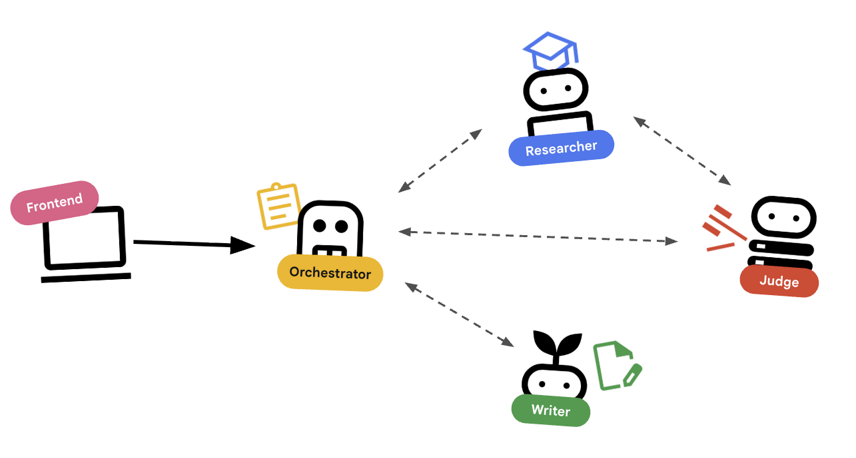
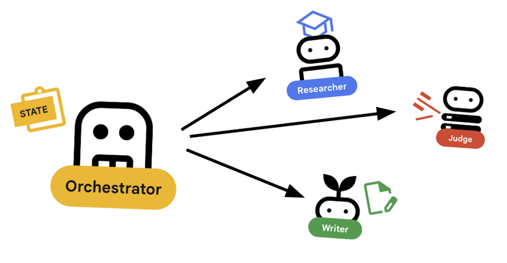
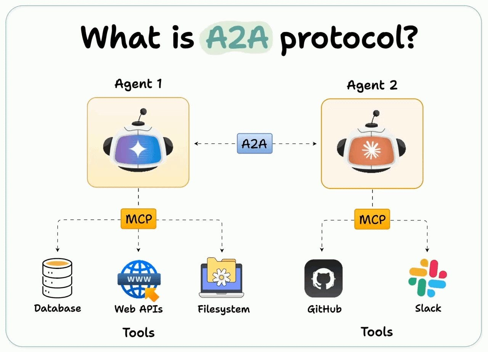

# Multi-agent lab
Based on the following resources:
* https://codelabs.developers.google.com/codelabs/production-ready-ai-roadshow/1-building-a-multi-agent-system/building-a-multi-agent-system#0
* https://github.com/GoogleCloudPlatform/devrel-demos

This project includes a course creation system that uses multiple AI agents for specific roles:
* Research agent: uses Google search to find up-to-date information
* Judge agent: critiques the research for quality and completeness
* Content builder agent: turns the research into a structured course
* Orchestrator agent: managing the workflow and communication between these specialists

**Why an orchestrator agent?**
* Better context management - if one agent gets context bloated, it may stray from the task. And it's easy for context bloating to occur, especially if the process is iterative or involves incremental improvement
* So instead of 1 agent running 50-100 loops and still producing crappy results, if you set the orchestrator agent to run 10 loops and each sub agent runs 10 loops, the context stays small for each agent and results improve
    * Harder to manage than using a single agent, but if it improves the output, the tradeoff may be worth it
* Also need orchestration to manage dependencies and order (i.e. deciding which agent goes first)


## System design



**Orchestrating with agents**
* Standard agents do work - using tools
* Orchestrator agents like `LoopAgent` or `SequentialAgent` purely delegate
* `LoopAgent`
    * Acts like a `while` loop in code. It runs a sequence of agents repeatedly until a condition is met (or max iterations are reached)
    * This will be used for the *Research Loop*
    * Researcher agent finds info
    * Judget critiques it
    * If Judge says "Fail", the `EscalationChecker` lets the loop continue
    * If the Judget says "Pass", the `EscalationChecker` breaks the loop
* `SequentialAgent` 
    * Acts like a standard script execution. It runs agents one after another, so we use this for the *high-level* pipeline
    * First, run the Research loop (until it finishes with good results)
    * Then, run the content builder (to write the course)

**Thoughts**
* Depending on what you're doing, you may not need a top-level `LoopAgent` that runs the *entire sequence* of agents. It may be better to only loop for specific agents, e.g. just the researcher. 
* Critiquing agents should always be tested - there shouldn't be a 100% acceptance rate, for example
* You can combine this workflow with other tools to minimize token usage or achieve other optimizations
    * e.g. a tool that transforms research texts into a more compact format by removing whitespace and structuring the output (like Pydantic), while still keeping a structure that doesn't affect the agent's processing capabilities
    * e.g. caveman - while it may not be suitable to use a skill like "caveman" for this specific project, it can significantly reduce output tokens and overall cost for some use cases: 
        * https://github.com/juliusbrussee/caveman
        * https://github.com/JuliusBrussee/caveman-code


## Key concepts with agents

### Structured output
* To automate workflows, we need *predictable* outputs
* By enforcing a schema on agent output, it can be parsed programmatically 
    * E.g. by structuring the Judget agent output, we can ensure it returns a boolean pass or fail that the rest of the code can reliably act upon

### Restricting agent behaviour
* Setting `disallow_transfer_to_parent` and `disallow_transfer_to_peers`, it forces structured output only to be returned, as defined in the `JudgeFeedback` schema
* It cannot decided to 'chat' with the user or delegate to another agent


### Context propagation
* How does the content bulider agent (which creates the course content) know what the research agent found? 
* In the ADK, agents in a pipeline can share context via the `session.state`
* The Orchestrator agent handles this - so that the Researcher and the Judge both save their outputs to a shared state
* The Content Builder can effectively access the context history from this



### A2A protocol
* Instead of running all agents as a single process, we can deploy them as independent microservices. 
* This allows each agent to scale independently and fail without crashing the entire system
* For this we need the Agent-to-Agent protocol (A2A)
    * What is it? It's an open standard that allows agents built from different frameworks to discover and talk to each other over HTTP
    * In production systems, agents run on different servers, different cloud environments, and are built using different frameworks - this requires an open standard of discovery and communication
    * `RemoteA2aAgent` is the ADK Client for this protocol

### MCP vs A2A

* What's the difference between these two protocols? Other than one is developed by Anthropic and the other is by Google?
* MCP - allows agents to connect to tools and data, to access databases, files and APIs
* A2A - inter-agent communication




### After Agent callbacks
* Functions to run after an Agent finishes its task - an async hook that runs immediately after an agent completes its execution loop, but before the response is delivered back to the end user
* For both Researcher and Judge agents, we use these callbacks:

```py
after_agent_callback=create_save_output_callback("research_findings"),
...
after_agent_callback=create_save_output_callback("judge_feedback"),
```

This is the callback:
```py
from google.adk.agents.callback_context import CallbackContext

def create_save_output_callback(key: str):
    """Creates a callback to save the agent's final response to session state."""
    def callback(callback_context: CallbackContext, **kwargs) -> None:
        ctx = callback_context
        # Find the last event from this agent that has content
        for event in reversed(ctx.session.events):
            if event.author == ctx.agent_name and event.content and event.content.parts:
                text = event.content.parts[0].text
                if text:
                    # Try to parse as JSON if it looks like it, for judge_feedback
                    if key == "judge_feedback" and text.strip().startswith("{"):
                        try:
                            ctx.state[key] = json.loads(text)
                        except json.JSONDecodeError:
                            ctx.state[key] = text
                    else:
                        ctx.state[key] = text
                    print(f"[{ctx.agent_name}] Saved output to state['{key}']")
                    return
    return callback
```

* `CallbackContext` (or `Context` in some versions) is a specialized object injected into lifecycle hooks to inspect, modify, or intercept the execution flow of an AI agent
* It can be used to pass context state from one agent to the other, modify it based on its own results (mutable), share artifacts (i.e. load or save files) and track metadata (e.g. environment values like `session_id`, `user_id`, `invocation_id` etc.)
* In the above example, the callback saves the previous agent's output to the context - specifically `state`
    * It gets the last event from the agent in the current session that has any content
    * It checks that the event.author is the current agent and that content exists
    * In the Google ADK, `event.content.parts[0].text` is the standard path to access the raw text payload of a conversational message event
    * It checks the key to check if it's "judge_feedback" and if so, structures the output as JSON (after stripping whitespace)
    * Finally, it saves output to session state

### Creating an authenticated client
* How authenticated clients are created:

```py
httpx_client=create_authenticated_client(researcher_url)
```

* Uses the Google Identity token authentication (OAuth2)
* If running in cloud, identity token is obtained from Compute metadata server
* If running locally, from gcloud CLI
* If ID token is successfully generated, use it in `Authorization` header

```py
# tries cloud first
try:
    credentials = fetch_id_token_credentials(
        audience=self.root_url,
    )
    credentials.refresh(Request())
    self.session = AuthorizedSession(
        credentials
    )
    id_token = self.session.credentials.token
except DefaultCredentialsError:
    self.outside_cloud = True
```

* Locally creates ID and refresh tokens if above fails:
```py
id_token = subprocess.check_output(
    [
        "gcloud",
        "auth",
        "print-identity-token",
        "-q"
    ]
).decode().strip()
if id_token:
    refresh_token = subprocess.check_output(
        [
            "gcloud",
            "auth",
            "print-refresh-token",
            "-q"
        ]
    ).decode().strip()
    credentials = Credentials(
        token=id_token,
        id_token=id_token,
        refresh_token=refresh_token
    )
    self.session = AuthorizedSession(
        credentials
    )
```

### Base Agent
* Not all agents use LLMs - sometimes it's just simple logic
* `BaseAgent` defines an agent that just runs code
* It's used here as an escalation check - if the Judge says "Pass" we want to immediately exit the loop and move to the Content Builder
* So this `BaseAgent` checks the session state and uses `EventActions(escalate=True)` to signal the `LoopAgent` to stop
    * This is **event-based** communication - agents can use `Events` which are signals to determine execution flow
    * By sending an event with `escalate=True` up to its parent `LoopAgent`, the `BaseAgent` ensures the loop terminates
    * The `LoopAgent` is programmed to catch the signal and terminate the loop
    * Max iterations should still be specified - in case the escalation event is never fired, because the Judge never says "pass" to any of the Researcher's results

**How to make an agent yield to events?**
* The `EscalationChecker` agent is build on top of the `BaseAgent` class
* The class overrides the `_run_async_impl` definition, which grabs the "judge_feedback" from `ctx.session.state` and parses it to check if the status is "pass"
* If pass, the method yields or generates the `escalate=True` event which signals the `LoopAgent` to stop
* If fail, the method just yields an event with the agent's name and the loop continues until max iterations are done


### Testing agents in isolation

Researcher:
1. Check status

```bash
curl http://localhost:8001/a2a/agent/.well-known/agent-card.json
```

2. Test prompt

```bash
curl -X POST http://localhost:8001/a2a/agent \
  -H "Content-Type: application/json" \
  -d '{
    "jsonrpc": "2.0",
    "method": "message/send",
    "id": 1,
    "params": {
      "message": {
        "message_id": "test-1",
        "role": "user",
        "parts": [
          {
            "text": "What is the capital of France?",
            "kind": "text"
          }
        ]
      }
    }
  }'
```

Judge:
1. Check status
2. Test protmp

```bash
curl -X POST http://localhost:8002/a2a/agent \
  -H "Content-Type: application/json" \
  -d '{
    "jsonrpc": "2.0",
    "method": "message/send",
    "id": 1,
    "params": {
      "message": {
        "message_id": "test-2",
        "role": "user",
        "parts": [
          {
            "text": "Topic: Tokyo. Findings: Tokyo is the capital of Japan.",
            "kind": "text"
          }
        ]
      }
    }
  }'
```

**Why JSON-RPC?**
* It's a lightweight, language-agnostic protocol that allows a program to request a remote system to execute a specific function 
* It allows a client to trigger a named "method" on the server, pass parameters, and receive responses or errors - all without worrying about the underlying transport mechanisms - HTTP, WebSockets, local I/O etc.
* It's used in agent frameworks e.g. A2A and MCP, because it matches well with the requirements:
    * Structured tool calling - requesting agent just needs to specify `method` (tool name) and `params` (arguments for the tool)
    * Async or batch operations - because JSON-RPC supports `id` fields and async responses, agents can send multiple simultaneous requests (batching with `id`s) or fire notifications (data sent without waiting for a reply)


### Testing all together
1. Set up your environment in three new tabs (terminals)

```
source .env
```

2. Run the Researcher, Judge and Content Builder in the three separate tabs

3. Capture the URLs for each sub-agent

4. Open another terminal - use the captured URLs to configure the sub-agents for the Orchestrator, then deploy the Orchestrator agent

5. Capture the Orchestrator URL - this can be used to access the remote deployment

6. Deploy the frontend application
* i.e. main.py code
